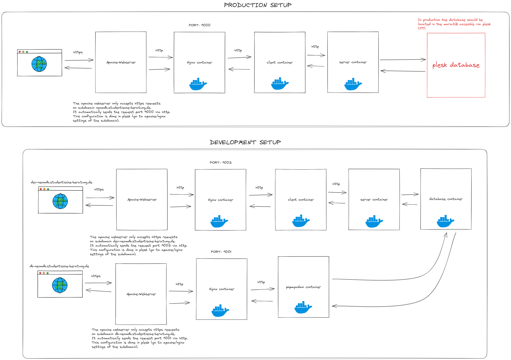

# DEPLOYMENT

This file explains how to deploy the neoMDB application.
We use Docker to deploy the neoMDB by composing different docker containers together.

## Folder structure

The nginx folder (`./nginx`) contains the nginx configuration files (see [NGINX](#nginx)).

The deployment folder (`./deployment`) contains the docker-compose files for composing the different containers for the testing, development or production environment. They use the respective .env files to set the environment variables.
The secrets folder (`./deployment/secrets`) contains the different password files that are used in the docker-compose files.

To setup all necessary files needed for deployment, go to the development folder in teams and copy the files in `client_files` into the client folder (and rename them from env.\*** to .env.\***)

## Dockerfiles

The client and the server both have a Dockerfile which specify the container build to run the client/server.

## Database

For demonstration purposes the first versions of the neoMDB application uses its own database located in a docker.

In the docker compose file(s) in `/deployment` a mysql container and a PhpMyAdmin container are run.

!IMPORTANT: Do not forget to add a database and user to the mysql container when deploying (see normal Setup - but remebmer, to use the user password specified in `secrets/db_neomdb_password`).
The database can be accessed via phpmyadmin over `db-neomdb.studentische-beratung.de`.

## NGINX

NGINX is needed for creating a proxy that routes the https requests to the client and to the server (configured in `./nginx/default-app.conf`) or to the database (configured in `./nginx/default-db.conf`).

## Docker Composition

Every Container in the docker-compose files is on the same network `neomdb_network`. Different environment variables for testing, development and production are used.
Secrets are used for the mysql root password and the database user password. Every secret has its own file in `./deployment/secrets` and is used inside of the respective docker-compose file.

### Development

The development setup (consisting of `docker-deploy.development.yaml` and `.env.development`) is used for testing docker containers locally. This can be the first step before deploying a new version to the testing environment (`test.neomdb.studentische-beratung.de`). Instead of using the images, the development setup uses the local code to build the containers.

### Testing

The testing setup (consisting of `docker-deploy.testing.yaml` and `.env.testing`) is used for testing the neomdb on the server (using `test.neomdb.studentische-beratung.de`). This is the final step before deploying a new version to production (`neomdb.studentische-beratung.de`). The image from our private repository are used to build the server and client containers.

### Production

The production setup (consisting of `docker-deploy.production.yaml` and `.env.production`) is used for testing docker containers on the server (using `neomdb.studentische-beratung.de`). The image from our private repository are used to build the server and client containers.

**Important Note**: The image for the client is build with a specific API_URL (for testing `test.neomdb.studentische-beratung.de/api` and for production `neomdb.studentische-beratung.de/api`) this means, that using the client image build for development for production or vice versa is not possible!

### Client Container

The Dockerfile of the client is used to build the neomdb client container.

### APP NGINX Container

The App NGINX Container (`nginx-app`) is built with the nginx image and saves the default-app.conf of NGINX in the container.

## DB NGINX Container

The DB NGINX Container (`nginx-db`) is built with the nginx image and saves the default-db.conf of NGINX in the container.
This nginx is serving the phpmadmin container. It is used to listen to port `9001` so that apache can route requests from a separate subdomain (`db-nemdb.studentische-beratung.de`) to this port (and secure it with SSL/TLS).

### Database Container

The Database Container is built with the mysql image and uses environment variable MYSQL_ROOT_PASSWORD_FILE to access the file with the mysql root password.

### PhpMyAdmin Container

The PhpMyAdmin Container is built with the phpmyadmin image and is linked to the database container, because it needs the mysql container to start before it can run.

### Server Container

The Dockerfile of the server is used to build the neomdb server container. It creates some environment variables to indicate that the server is running in production (which changes some configurations), where the database host is located, which port for the database is used where the file with the database password is located and which origin should be whitelisted in CORS.

## Process

**Important Note**: The `[-demo]` in the following commands stands for the optional value of "demo". In the future not every deployment is a demo. Later normal releases are without the demo tag.
The X.Y.Z are placeholder for the version of the image. X is increased after every major update (new module). Y is increased for a smaller adjustment and Z is increased when the version conatins a patch (bug fix).

_Example_: Adding a new module (e.g. CRM) increases e.g. X=2 to X=3, adding a new page or adding a new logo increases e.g Y=1 to Y=2 and deploying a bug fix increases e.g. Z=4 to Z=5.

1.  Test application by running all containers and accessing the application:

    1.1 Navigate into `/deployment`and start testing docker-compose: `docker-compose -f docker-compose.testing.yaml --env-file .env.testing up --build`

    1.2 Go to `localhost:9000` to access the application and test if everything works

2.  Build images for server and backend

    2.1 Build image for the client:

         2.1.1 Navigate into `/client`

          2.1.2 Run `docker build -t jbtit/neomdb:client[-demo]X.Y.Z --build-arg REACT_APP_ENV=production .` for production build
          OR
          Run `docker build -t jbtit/neomdb:client[-demo]X.Y.Z --build-arg REACT_APP_ENV=development .` for development/demo build

    2.2 Build image for the server:

         2.2.1 Navigate into `/server`

         2.2.2 Run `docker build -t jbtit/neomdb:server[-demo]X.Y.Z .`

3.  Push the image to the private docker repository

    3.1 Run `docker login` and insert username and password

    3.2 Run `docker push jbtit/neomdb:client[-demo]X.Y.Z`

    3.3 Run `docker push jbtit/neomdb:server[-demo]X.Y.Z`

4.  Adjust docker-compose file (e.g. adjust tag of client and server image) and deploy it on the server (`/var/www/vhosts/studentische-beratung.de/neomdb`)
5.  Log into the server, navigate to `/var/www/vhosts/studentische-beratung.de/neomdb/deployment` and run `docker compose -f docker-compose.production.yaml --env-file .env.production up -d --build` for production build OR `docker compose -f docker-compose.development.yaml --env-file .env.development up -d --build` for development/demo build

Note: On the server docker uses limited-priviliege access token from docker and not the login credentials to the whole repository.

## Setup database

To use the development or testing environment, you have to setup the database just like you would for local development.
To access phpMyAdmin use localhost:9001 (use the password in the secrets folder to gain root access and create the user).

## Deployment Diagram

